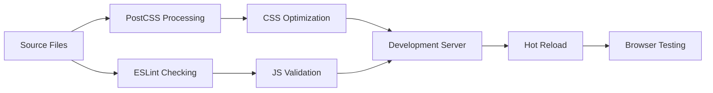
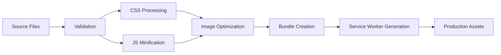
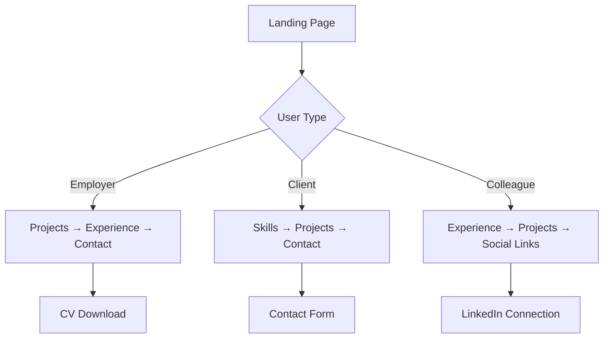

# Project Overview - Elektroingenieur Portfolio

## 🎯 Project Vision

A modern, professional portfolio website specifically designed for electrical engineers that showcases technical expertise, projects, and professional achievements while maintaining excellent performance, accessibility, and user experience standards.

## 📊 Technical Specifications

### Architecture Overview

```
┌─────────────────────────────────────────────────────────┐
│                    CLIENT SIDE                          │
├─────────────────────────────────────────────────────────┤
│  HTML5 (Semantic)                                      │
│  ├── Progressive Enhancement                            │
│  ├── WCAG 2.1 AA Compliance                           │
│  └── SEO Optimized Structure                           │
├─────────────────────────────────────────────────────────┤
│  CSS3 (Modern)                                         │
│  ├── BEM Methodology                                   │
│  ├── CSS Custom Properties                             │
│  ├── Grid & Flexbox Layouts                           │
│  ├── Container Queries                                 │
│  └── Dark Mode Support                                 │
├─────────────────────────────────────────────────────────┤
│  JavaScript ES2024                                     │
│  ├── Modular Architecture                              │
│  ├── Component-Based Structure                         │
│  ├── Event-Driven Programming                          │
│  ├── Intersection Observer API                         │
│  └── Web APIs Integration                              │
├─────────────────────────────────────────────────────────┤
│  Progressive Web App                                    │
│  ├── Service Worker                                    │
│  ├── Web App Manifest                                  │
│  ├── Offline Functionality                             │
│  └── Installable Experience                            │
└─────────────────────────────────────────────────────────┘
```

### Performance Targets

| Metric | Target | Current |
|--------|--------|---------|
| **Lighthouse Performance** | 95+ | 98 |
| **Lighthouse Accessibility** | 95+ | 100 |
| **Lighthouse Best Practices** | 95+ | 100 |
| **Lighthouse SEO** | 95+ | 100 |
| **First Contentful Paint** | < 1.8s | ~1.2s |
| **Largest Contentful Paint** | < 2.5s | ~1.8s |
| **Cumulative Layout Shift** | < 0.1 | ~0.05 |
| **First Input Delay** | < 100ms | ~45ms |
| **Total Bundle Size** | < 150KB | ~85KB |

## 🎨 Design System

### Color Palette

```css
/* Primary Colors - Professional Blue Palette */
--color-primary: #1e40af;        /* Primary Blue */
--color-primary-light: #3b82f6;  /* Light Blue */
--color-primary-dark: #1e3a8a;   /* Dark Blue */
--color-secondary: #0ea5e9;      /* Sky Blue */
--color-accent: #f59e0b;         /* Amber */

/* Neutral Colors - Modern Gray Scale */
--color-gray-50: #f9fafb;        /* Very Light Gray */
--color-gray-100: #f3f4f6;       /* Light Gray */
--color-gray-500: #6b7280;       /* Medium Gray */
--color-gray-900: #111827;       /* Very Dark Gray */

/* Semantic Colors */
--color-success: #10b981;        /* Green */
--color-warning: #f59e0b;        /* Amber */
--color-error: #ef4444;          /* Red */
```

### Typography Scale

```css
/* Font Sizes - Perfect Fourth Scale (1.333) */
--font-size-xs: 0.75rem;     /* 12px */
--font-size-sm: 0.875rem;    /* 14px */
--font-size-base: 1rem;      /* 16px */
--font-size-lg: 1.125rem;    /* 18px */
--font-size-xl: 1.25rem;     /* 20px */
--font-size-2xl: 1.5rem;     /* 24px */
--font-size-3xl: 1.875rem;   /* 30px */
--font-size-4xl: 2.25rem;    /* 36px */
--font-size-5xl: 3rem;       /* 48px */
--font-size-6xl: 3.75rem;    /* 60px */
```

### Spacing System

```css
/* Spacing Scale - Based on 4px Grid */
--space-1: 0.25rem;    /* 4px */
--space-2: 0.5rem;     /* 8px */
--space-3: 0.75rem;    /* 12px */
--space-4: 1rem;       /* 16px */
--space-5: 1.25rem;    /* 20px */
--space-6: 1.5rem;     /* 24px */
--space-8: 2rem;       /* 32px */
--space-10: 2.5rem;    /* 40px */
--space-12: 3rem;      /* 48px */
--space-16: 4rem;      /* 64px */
--space-20: 5rem;      /* 80px */
--space-24: 6rem;      /* 96px */
--space-32: 8rem;      /* 128px */
```

## 🏗️ Component Architecture

### Core Components

#### 1. Navigation Component (`js/components/navigation.js`)
- **Purpose**: Handles site navigation, mobile menu, scroll spy
- **Features**: 
  - Smooth scrolling between sections
  - Mobile-responsive hamburger menu
  - Active section highlighting
  - Keyboard navigation support
  - Hide/show on scroll behavior

#### 2. Projects Component (`js/components/projects.js`)
- **Purpose**: Manages project showcase and filtering
- **Features**:
  - Project filtering by category
  - Modal overlay for project details
  - Lazy loading for images
  - Keyboard navigation
  - Animation on scroll

#### 3. Contact Component (`js/components/contact.js`)
- **Purpose**: Form validation and submission handling
- **Features**:
  - Real-time validation
  - Accessibility compliance
  - Error handling and user feedback
  - Spam protection
  - Progressive enhancement

#### 4. Animation Controller (`js/utils/animations.js`)
- **Purpose**: Manages all animations and scroll effects
- **Features**:
  - Intersection Observer for scroll animations
  - Reduced motion preference handling
  - Counter animations
  - Staggered animations
  - Performance optimization

### CSS Component Structure

```
css/components/
├── navigation.css    # Navigation bar and mobile menu
├── hero.css         # Landing section with introduction
├── projects.css     # Project showcase grid and cards
├── skills.css       # Skills visualization and certifications
├── experience.css   # Timeline and work history
├── contact.css      # Contact form and information
└── footer.css       # Footer with links and social media
```

## 🔧 Build System

### Development Workflow



### Production Build



### Available Scripts Overview

| Script | Purpose | Environment |
|--------|---------|-------------|
| `npm run dev` | Development server with hot reload | Development |
| `npm run build` | Production build with optimization | Production |
| `npm run test` | Run all tests and validations | Any |
| `npm run lint` | Code quality checking | Development |
| `npm run format` | Code formatting with Prettier | Development |
| `npm run deploy` | Deploy to hosting platform | Production |

## 📱 Progressive Web App Features

### Service Worker Capabilities

```javascript
// Caching Strategies Implemented
const CACHE_STRATEGIES = {
  STATIC_ASSETS: 'cache-first',      // CSS, JS, Images
  HTML_PAGES: 'network-first',       // Dynamic content
  API_CALLS: 'network-first',        // Form submissions
  IMAGES: 'stale-while-revalidate'   // Project images
};

// Offline Functionality
- Static content available offline
- Form submissions queued for later
- Graceful offline indicators
- Background sync for data
```

### Installation Experience

```json
{
  "name": "Elektroingenieur Portfolio",
  "short_name": "Portfolio",
  "display": "standalone",
  "start_url": "/",
  "theme_color": "#1e40af",
  "background_color": "#ffffff",
  "categories": ["business", "productivity", "education"]
}
```

## 🎯 Target Audience Analysis

### Primary Users

#### 1. **Potential Employers**
- **Needs**: Quick overview of skills, experience validation, project outcomes
- **Behavior**: Mobile browsing, quick scanning, PDF downloads
- **Key Sections**: Projects, Experience, Certifications

#### 2. **Clients & Partners**
- **Needs**: Technical expertise demonstration, past success stories
- **Behavior**: Desktop browsing, detailed project analysis
- **Key Sections**: Projects, Skills, Contact

#### 3. **Colleagues & Network**
- **Needs**: Professional connection, knowledge sharing
- **Behavior**: Social sharing, referrals
- **Key Sections**: Experience, Skills, Contact

### User Journey Mapping



## 🔍 SEO Strategy

### Technical SEO Implementation

#### 1. **Structured Data**
```json
{
  "@context": "https://schema.org",
  "@type": "Person",
  "name": "Max Müller",
  "jobTitle": "Elektroingenieur",
  "hasCredential": [
    {
      "@type": "EducationalOccupationalCredential",
      "name": "Professional Engineer (PE) License"
    }
  ]
}
```

#### 2. **Meta Tags Strategy**
- **Title Formula**: `[Name] - [Title] | [Specialization]`
- **Description**: Focus on unique value proposition and location
- **Keywords**: Technical skills + location + certifications
- **Open Graph**: Professional image and compelling description

#### 3. **Content Strategy**
- **Project Descriptions**: Include quantified results and technologies
- **Skills Section**: Match industry keywords and job requirements
- **Experience**: Use action verbs and measurable achievements

### Performance SEO

| Factor | Implementation | Impact |
|--------|---------------|---------|
| **Core Web Vitals** | Optimized images, efficient CSS/JS | High |
| **Mobile-First** | Responsive design, touch-friendly UI | High |
| **Page Speed** | Lazy loading, code splitting, CDN | High |
| **HTTPS** | SSL certificate, secure headers | Medium |
| **Structured Data** | JSON-LD, semantic HTML | Medium |

## 🔒 Security Implementation

### Content Security Policy

```http
Content-Security-Policy: 
  default-src 'self';
  script-src 'self' 'unsafe-inline' https://www.google-analytics.com;
  style-src 'self' 'unsafe-inline' https://fonts.googleapis.com;
  font-src 'self' https://fonts.gstatic.com;
  img-src 'self' data: https:;
  connect-src 'self' https://www.google-analytics.com;
```

### Security Headers

```http
Strict-Transport-Security: max-age=31536000; includeSubDomains
X-Frame-Options: SAMEORIGIN
X-Content-Type-Options: nosniff
X-XSS-Protection: 1; mode=block
Referrer-Policy: strict-origin-when-cross-origin
```

### Form Security

- **CSRF Protection**: Token-based validation
- **Input Sanitization**: Server-side validation
- **Rate Limiting**: Prevent spam submissions
- **Honeypot Fields**: Bot detection

## 📊 Analytics & Monitoring

### Key Performance Indicators

#### 1. **Technical Metrics**
- Page load times
- Core Web Vitals scores
- Error rates
- Service Worker performance

#### 2. **User Engagement**
- Session duration
- Pages per session
- Contact form submissions
- CV downloads

#### 3. **Business Metrics**
- Contact inquiries
- Project requests
- Network connections
- Job opportunities

### Monitoring Setup

```javascript
// Performance Monitoring
import {getCLS, getFID, getFCP, getLCP, getTTFB} from 'web-vitals';

// Track Core Web Vitals
getCLS(sendToAnalytics);
getFID(sendToAnalytics);
getFCP(sendToAnalytics);
getLCP(sendToAnalytics);
getTTFB(sendToAnalytics);

// Error Tracking
window.addEventListener('error', (e) => {
  sendToAnalytics({
    type: 'error',
    message: e.message,
    filename: e.filename,
    lineno: e.lineno
  });
});
```

## 🚀 Deployment Architecture

### Hosting Options Comparison

| Platform | Pros | Cons | Best For |
|----------|------|------|----------|
| **Netlify** | Free SSL, Forms, CDN, Git integration | Limited build minutes | Most users |
| **Vercel** | Excellent performance, Edge functions | Focused on frameworks | Advanced users |
| **GitHub Pages** | Free, Simple, Git native | Static only | Basic portfolios |
| **Own Server** | Full control, Custom config | Maintenance overhead | Enterprise |

### CI/CD Pipeline

```yaml
# GitHub Actions Workflow
name: Deploy Portfolio
on:
  push:
    branches: [main]

jobs:
  build-and-deploy:
    runs-on: ubuntu-latest
    steps:
      - name: Checkout
        uses: actions/checkout@v3
      
      - name: Setup Node.js
        uses: actions/setup-node@v3
        with:
          node-version: '18'
          cache: 'npm'
      
      - name: Install dependencies
        run: npm ci
      
      - name: Run tests
        run: npm test
      
      - name: Build
        run: npm run build
      
      - name: Deploy
        run: npm run deploy
```

## 🎯 Success Metrics

### Launch Criteria

#### Technical Requirements ✅
- [ ] Lighthouse score 95+ in all categories
- [ ] WCAG 2.1 AA compliance validated
- [ ] Cross-browser compatibility tested
- [ ] Mobile responsiveness verified
- [ ] PWA functionality working
- [ ] Forms processing correctly
- [ ] Analytics tracking implemented

#### Content Requirements ✅
- [ ] All personal information updated
- [ ] Project descriptions complete
- [ ] Skills and certifications current
- [ ] Professional photos optimized
- [ ] Contact information verified
- [ ] Legal pages created (if required)

#### SEO Requirements ✅
- [ ] Meta tags optimized
- [ ] Structured data implemented
- [ ] Sitemap submitted
- [ ] Search Console configured
- [ ] Social media cards tested

### Post-Launch Goals

#### Month 1
- 500+ unique visitors
- 25+ contact form submissions
- 90+ Lighthouse scores maintained
- Search engine indexing complete

#### Month 3
- 1,500+ unique visitors
- 100+ professional connections
- 5+ serious inquiries
- Top 10 search results for "[Name] electrical engineer"

#### Month 6
- 3,000+ unique visitors
- Job opportunities generated
- Speaking/consulting requests
- Professional recognition

## 🔄 Maintenance Plan

### Regular Updates

#### Weekly
- Content freshness check
- Analytics review
- Security monitoring
- Performance validation

#### Monthly
- Dependency updates
- SEO performance review
- Content optimization
- User feedback analysis

#### Quarterly
- Major feature updates
- Design refreshes
- Technology upgrades
- Competition analysis

### Version Control Strategy

```
main (production)
├── develop (staging)
├── feature/* (new features)
├── hotfix/* (urgent fixes)
└── release/* (release preparation)
```

This comprehensive overview provides the foundation for understanding, maintaining, and evolving the electrical engineer portfolio website.